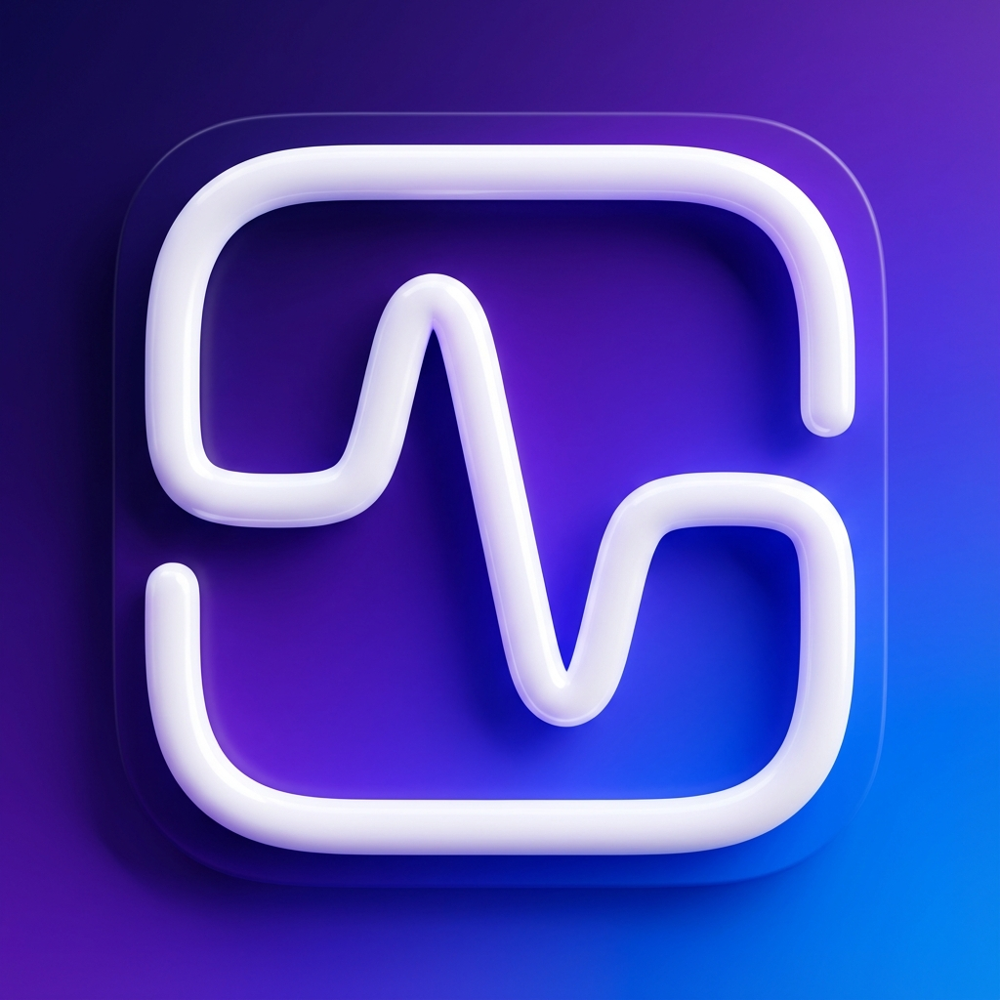

<div align="center">
  
  <h1>Pulse</h1>
  <p>
    <b>A beautiful, native macOS menu bar utility for monitoring and managing system processes.</b>
  </p>
  <p>
    <a href="https://github.com/romeet9/Pulse/releases">
      
    </a>
    
    
  </p>
</div>

---

**Pulse** is designed to feel like a native part of macOS. It helps you identify resource hogs, keeps your Mac running smoothly, and looks stunning while doing it.

## ✨ Features

- **💧 Liquid Glass UI**: A stunning, translucent interface that uses native `VisualEffectView` to blend perfectly with your wallpaper.
- **🧠 Smart Clean Intelligence**: uses a heuristic engine to identify idle, memory-hungry background apps and suggests them for termination.
- **⚡️ Visual Intelligence**: Features a native, GPU-accelerated "Liquid Pulse" animation during system analysis.
- **🗑 App Manager**: Easily **Force Quit (X)** or completely **Uninstall (Trash)** applications directly from the menu bar.
- **🚀 Native Performance**: Built with Swift 5 and SwiftUI for maximum efficiency and negligible footprint (~10MB memory usage).

## 📥 Installation

### Option 1: Pre-built Release
1. Download **`Pulse_Release.zip`** from the [**Releases Page**](https://github.com/romeet9/Pulse/releases).
2. Unzip the file.
3. Drag `Pulse.app` to your **Applications** folder.
4. **Note**: Since this app is not notarized, you may see an "Unverified Developer" warning.
   - **Right-click (Control-click)** on Pulse.app and select **Open**.
   - Click **Open** in the dialog box.

### Option 2: Build from Source
1. Clone this repository:
   ```bash
   git clone https://github.com/romeet9/Pulse.git
   ```
2. Run the installer script:
   ```bash
   cd Pulse
   ./install_pulse.sh
   ```

## 🛠 Compatibility
- **macOS 14.0 (Sonoma)** or later.
- Optimized for Apple Silicon (M1/M2/M3) and Intel Macs.
